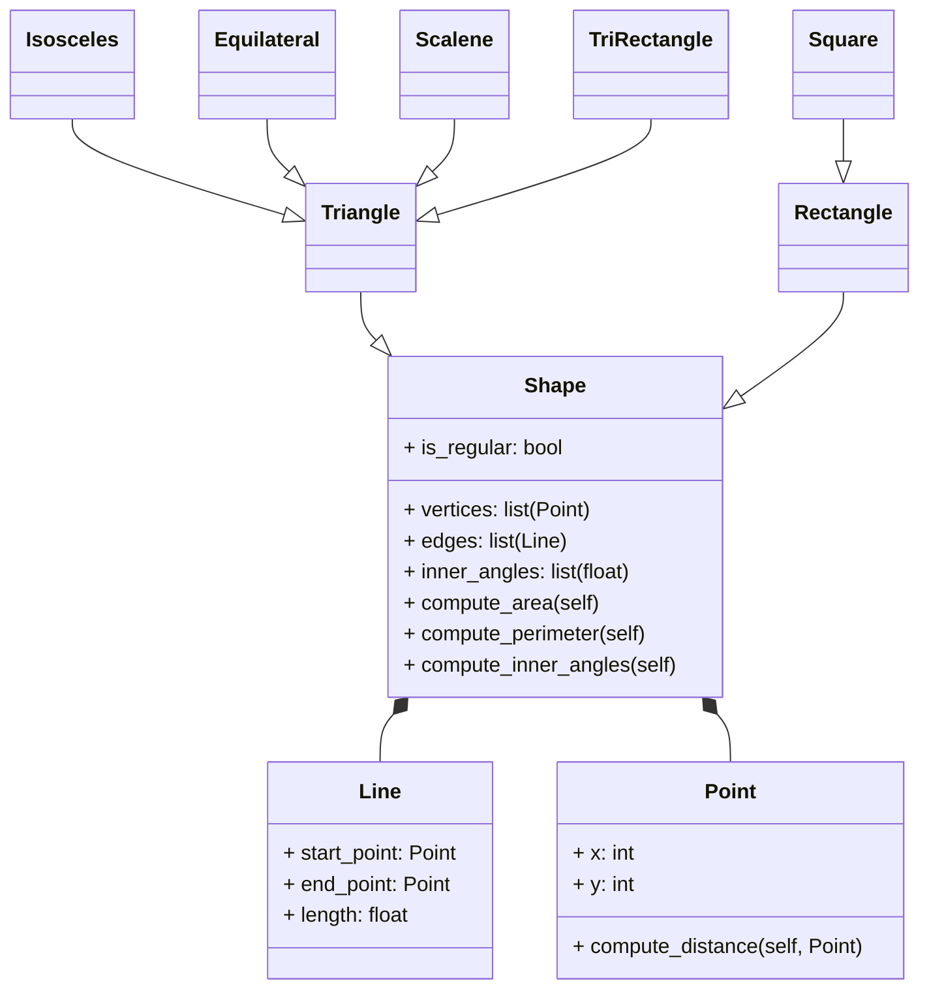

# reto_4
This repository refers to the activities proposed for class 10 of the Object Oriented Pogramming course.
___
## Clase *Figura*
Se ha creado la clase *Shape*, y subclases adicionales a esta nombradas *Triangle*, *Isosceles*, *Equilateral*, *Scalene*, *TriRectangle*, de manera que satisfagan todos los atributos representados en el siguiente diagrama:

Así mismo, se hizo implementación necesaria sobre encapsulación transformando algunos atributos en **protegidos**, y aplicando **setters** y **getters** en donde convenía. De la misma manera, se hizo un uso extensivo de composición y herencia a la hora de construir las clases, y se reimplementó el método de creación de la clase *Rectangle* y a su vez de la clase *Square* haciendo que coincidieran con la implementación de *Shape*, comparado a los cuatro métodos implementados para el reto anterior. <br>
Se hizo uso del paquete **math** del cual se utilizaron métodos como ***acos*** y ***degrees*** en la construcción de las listas de ángulos internos de las diferentes figuras. A su vez, de este paquete se utilizó el método ***isclose*** que funciona de manera similar al operador de comparacion ***==***, pero que compara valores con cercanía y cierta tolerancia específicada, así contrarrestando el error existente al hacer cálculos de punto flotante, útil sobre todo a la hora de crear las subclases de *Triangle*.
```Python
import math

class Point():
    definition: str = "Entidad geometrica abstracta que representa una ubicación en un espacio."
    def __init__(self, x: float=0, y: float=0):
        self._x = x
        self._y = y

    @property
    def x(self):
        return self._x
    @x.setter
    def x(self, new_x):
        self._x = new_x

    @property
    def y(self):
        return self._y
    @y.setter
    def y(self, new_y):
        self._y = new_y
    
    def reset(self):
        self.x = 0
        self.y = 0
    def compute_distance(self, point: "Point")-> float:
        distance = ((self.x - point.x)**2+(self.y - point.y)**2)**(0.5)
        return distance
    def __repr__(self):
        return f"({self.x},{self.y})"
    
class Line():
    def __init__(self, start_point: Point, end_point: Point):
        self._start: Point = start_point
        self._end: Point = end_point
        self._length: float = start_point.compute_distance(end_point)
        self._slope: float = self.compute_slope()

    @property
    def start(self):
        return self._start
    @property
    def y(self):
        return self._y
    
    def compute_length(self) -> float:
        return self._length
    def compute_slope(self) -> float:
        slope: float = None
        if self._end.x - self._start.x == 0:
            slope = None
            return slope
        else:
            slope = (self._end.y - self._start.y) / (self._end.x - self._start.x)
            return round(slope, 3)
    def compute_horizontal_cross(self) -> bool:
        x_intersect: bool = False
        if self._start.y >= 0 and self._end.y <= 0:
            x_intersect = True
        elif self._start.y <= 0 and self._end.y >= 0:
            x_intersect = True
        return x_intersect
    def compute_vertical_cross(self) -> bool:
        y_intersect: bool = False
        if self._start.x >= 0 and self._end.x <= 0:
            y_intersect = True
        elif self._start.x <= 0 and self._end.x >= 0:
            y_intersect = True
        return y_intersect
    def discretize_line(self, n : int) -> list:
        i: int = 0
        points: list = []
        while(i < n):
            aux_x = self._start.x + ((i / (n - 1)) * (self._end.x - self._start.x))
            aux_y = self._start.y + ((i / (n - 1)) * (self._end.y - self._start.y))
            points.append(Point(round(aux_x, 3),round(aux_y, 3)))
            i += 1
        return points
    def __str__(self):
        result: list = [
            f"Start: {self._start}",
            f"End: {self._end}",
            f"Length: {self.compute_length()}",
            f"Slope: {self.compute_slope()}",
            f"Cross x-axis: {self.compute_horizontal_cross()}",
            f"Cross y-axis: {self.compute_vertical_cross()}"
        ]
        return "\n".join(result)

class Shape():
    def __init__(self, vertices: list, edges: list):
        self._vertices: list = vertices
        self._edges: list = edges
        self._inner_angles: list = self.compute_inner_angles()
        self.is_regular: bool = False
    def compute_inner_angles(self) -> list:
        angles: list = []
        n_verts = len(self._vertices)
        for i in range(n_verts):
            prev_vert = self._vertices[i - 1]
            midl_vert = self._vertices[i]
            next_vert = self._vertices[(i + 1) % n_verts]

            v = [prev_vert.x - midl_vert.x, prev_vert.y - midl_vert.y]
            u = [next_vert.x - midl_vert.x, next_vert.y - midl_vert.y]

            dot_prod = v[0] * u[0] + v[1] * u[1]
            norm_v = ((v[0] * v[0]) + (v[1] * v[1])) ** 0.5
            norm_u = ((u[0] * u[0]) + (u[1] * u[1])) ** 0.5

            cos_angle = dot_prod / (norm_u * norm_v)
            cos_angle = max(-1.0, min(1.0, cos_angle))
            angle_rad = math.acos(cos_angle)
            angle_deg = math.degrees(angle_rad)

            angles.append(round(angle_deg, 3))
        return angles
    def compute_area():
        raise NotImplementedError("Must be implemented in subclass!!")
    def compute_perimeter():
        raise NotImplementedError("Must be implemented in subclass!!")

class Rectangle(Shape):
    def __init__(self, vertices: list, edges: list):
        super().__init__(vertices, edges)
        self.width: float = self._edges[0].compute_length()
        self.height: float = self._edges[1].compute_length()
        if self.width == self.height:
            self.is_regular: bool = True
        else:
            self.is_regular: bool = False
    def compute_area(self) -> float:
        return self.width * self.height
    def compute_perimeter(self) -> float:
        return 2*self.width + 2*self.height
    def __str__(self):
        result: list = [
            f"Vertices: {self._vertices}",
            f"Inner Angles: {self._inner_angles}",
            f"Width: {self.width}",
            f"Height: {self.height}",
            f"Regular Shape: {self.is_regular}",
            f"Area: {self.compute_area()}",
            f"Perimeter: {self.compute_perimeter()}"
        ]
        return "\n".join(result)  
      
class Square(Rectangle):
    def __init__(self, vertices: list, edges: list):
        super().__init__(vertices, edges)
        if not (self._edges[0].compute_length() == self._edges[1].compute_length()):
            raise ValueError("Not a Square")
        self.side_length: float = self._edges[0].compute_length()
        self.is_regular: bool = True
    def compute_area(self) -> float:
        return self.side_length ** 2
    def compute_perimeter(self) -> float:
        return 4 * self.side_length
    def __str__(self):
        result: list = [
            f"Vertices: {self._vertices}",
            f"Inner Angles: {self._inner_angles}",
            f"Side Length: {self.side_length}",
            f"Regular Shape: {self.is_regular}",
            f"Area: {self.compute_area()}",
            f"Perimeter: {self.compute_perimeter()}"
        ]
        return "\n".join(result)  
    
class Triangle(Shape):
    def __init__(self, vertices: list, edges: list):
        super().__init__(vertices, edges)
        self._a: float = self._edges[0].compute_length()
        self._b: float = self._edges[1].compute_length()
        self._c: float = self._edges[2].compute_length()
        if math.isclose(self._a, self._b) and math.isclose(self._b, self._c):
            self.is_regular: bool = True
        else:
            self.is_regular: bool = False
    def compute_perimeter(self):
        perimeter: float = self._a + self._b + self._c
        return round(perimeter, 3)
    def compute_area(self) -> float:
        s: float = self.compute_perimeter() / 2
        area : float = (s * (s - self._a) * (s - self._b) * (s - self._c)) ** 0.5
        return round(area, 3)
    def __str__(self):
        result: list = [
            f"Vertices: {self._vertices}",
            f"Inner Angles: {self._inner_angles}",
            f"Regular Shape: {self.is_regular}",
            f"Area: {self.compute_area()}",
            f"Perimeter: {self.compute_perimeter()}"
        ]
        return "\n".join(result)  
    
class Isosceles(Triangle):
    def __init__(self, vertices: list, edges: list):
        super().__init__(vertices, edges)
        if not (math.isclose(self._a, self._b) or math.isclose(self._b, self._c) or math.isclose(self._a, self._c)):
            raise ValueError("Not an Isosceles triangle!!")
    def compute_perimeter(self):
        return super().compute_perimeter()
    def compute_area(self):
        return super().compute_area()
    def __str__(self):
        return super().__str__()
    
class Equilateral(Triangle):
    def __init__(self, vertices: list, edges: list):
        super().__init__(vertices, edges)
        self.is_regular: bool = True
        if not (math.isclose(self._a, self._b) and math.isclose(self._b, self._c)):
            raise ValueError("Not an Equilateral triangle!!")
    def compute_perimeter(self):
        return super().compute_perimeter()
    def compute_area(self):
        return super().compute_area()
    def __str__(self):
        return super().__str__()
    
class Scalene(Triangle):
    def __init__(self, vertices: list, edges: list):
        super().__init__(vertices, edges)
        if math.isclose(self._a, self._b) or math.isclose(self._b, self._c) or math.isclose(self._a, self._c):
            raise ValueError("Not an Scalene triangle!!")
    def compute_perimeter(self):
        return super().compute_perimeter()
    def compute_area(self):
        return super().compute_area()
    def __str__(self):
        return super().__str__()
    
class TriRectangle(Triangle):
    def __init__(self, vertices:list, edges: list):
        super().__init__(vertices, edges)
        if not any(math.isclose(angle, 90.0) for angle in self._inner_angles):
            raise ValueError("Not a Right Triangle!!")
    def compute_perimeter(self):
        return super().compute_perimeter()
    def compute_area(self):
        return super().compute_area()
    def __str__(self):
        return super().__str__()

if __name__ == "__main__":
    
    # Test Rectangle (_vertices in order: bottom-left, bottom-right, top-right, top-left)
    rect_points = [Point(0,0), Point(4,0), Point(4,2), Point(0,2)]
    rect_lines = [
        Line(rect_points[0], rect_points[1]),
        Line(rect_points[1], rect_points[2]),
        Line(rect_points[2], rect_points[3]),
        Line(rect_points[3], rect_points[0])
    ]
    rectangle = Rectangle(rect_points, rect_lines)
    print("\nRectangle object:")
    print(rectangle)

    # Test Square
    square_points = [Point(1,1), Point(4,1), Point(4,4), Point(1,4)]
    square_lines = [
        Line(square_points[0], square_points[1]),
        Line(square_points[1], square_points[2]),
        Line(square_points[2], square_points[3]),
        Line(square_points[3], square_points[0])
    ]
    square = Square(square_points, square_lines)
    print("\nSquare Object:")
    print(square)

    # Test Triangle (vertices in order: A, B, C)
    tri_points = [Point(0, 0), Point(4, 0), Point(2, 3)]
    tri_lines = [
        Line(tri_points[0], tri_points[1]),
        Line(tri_points[1], tri_points[2]),
        Line(tri_points[2], tri_points[0])
    ]
    triangle = Triangle(tri_points, tri_lines)
    print("\nTriangle Object:")
    print(triangle)

    # Test Isosceles Triangle
    iso_points = [Point(0, 0), Point(2, 0), Point(1, 2)]
    iso_lines = [
        Line(iso_points[0], iso_points[1]),
        Line(iso_points[1], iso_points[2]),
        Line(iso_points[2], iso_points[0])
    ]
    isosceles = Isosceles(iso_points, iso_lines)
    print("\nIsosceles Object:")
    print(isosceles)
    
    # Test Equilateral Triangle
    eq_points = [Point(0, 0), Point(1, 0), Point(0.5, math.sqrt(3)/2)]
    eq_lines = [
        Line(eq_points[0], eq_points[1]),
        Line(eq_points[1], eq_points[2]),
        Line(eq_points[2], eq_points[0])
    ]
    equilateral = Equilateral(eq_points, eq_lines)
    print("\nEquilateral Object:")
    print(equilateral)

    # Test Scalene Triangle
    sca_points = [Point(0, 0), Point(4, 0), Point(3, 5)]
    sca_lines = [
        Line(sca_points[0], sca_points[1]),
        Line(sca_points[1], sca_points[2]),
        Line(sca_points[2], sca_points[0])
    ]
    scalene = Scalene(sca_points, sca_lines)
    print("\nScalene Object:")
    print(scalene)

    # Test Right Triangle (TriRectangle)
    right_points = [Point(0, 0), Point(3, 0), Point(0, 4)]
    right_lines = [
        Line(right_points[0], right_points[1]),
        Line(right_points[1], right_points[2]),
        Line(right_points[2], right_points[0])
    ]
    right_triangle = TriRectangle(right_points, right_lines)
    print("\nRight Triangle Object:")
    print(right_triangle)
```
___

## Escenario de Restaurante
Se implementó el encapsulamiento en el escenario de orden de restaurante, y cada clase necesaria tuvo su propio **setter** y **getter** definido de manera pythonica. Así mismo, se implementaron una serie de "descuentos" en el método ***calculate_total_bill*** de la clase *Order*, que al haber comprado un item de *MainCourse* cualquier *Beverage*, tenía $1.50 de descuento, u otro descuento funcionaba que apartir del segundo item de *Dessert* comprado, se tendría un descuento de $1.50 del mismo modo. <br>
También, basándose en el ejemplo de clase, se implementó una clase *PaymentMethod*, con dos subclases *CreditCard* y *Cash* que funcionaban como métodos de pago, referentes a la clase *Order* y su método de ***calculate_total_bill***
```Python
class MenuItem:
    def __init__(self, name: str, price: float = 0):
        self._name = name
        self._price = price
    
    @property
    def name(self) -> str:
        return self._name
    @name.setter
    def name(self, new_name: str):
        if isinstance(new_name, str):
            self._name = new_name
        else:
            raise TypeError("Invalid name. Must be a String")
    @property
    def price(self) -> float:
        return self._price
    @price.setter
    def price(self, new_price: float):
        if new_price >= 0:
            self._price = new_price
        else:
            raise ValueError("Invalid price. Must be greater or equal to 0")
        
    def calculate_total() ->float:
        raise NotImplementedError("Must be implemented by subclasses!")
    
class MainCourse(MenuItem):
    def __init__(self, name: str, price: float, description: str, side_dish: str = None):
        super().__init__(name, price)
        self.__description = description
        self.side_dish = side_dish

    @property
    def description(self) -> str:
        return self.__description
    @description.setter
    def description(self, new_description: str):
        if isinstance(new_description, str):
            self.__description = new_description
        else:
            raise TypeError("Invalid description. Must be a String")

    def calculate_total(self) -> float:
        if self.side_dish:
            return round(self.price + 3,3)
        else:
            return self.price
    def __str__(self):
        return f"{self.name}, Side dish: {self.side_dish} --- ${self.calculate_total()}\n{self.description}"
    
class Beverage(MenuItem):
    def __init__(self, name: str, price: float, size: int):
        super().__init__(name, price)
        self.__size = size

    @property
    def size(self) -> float:
        return self.__size
    @size.setter
    def size(self, new_size: float):
        if new_size >= 0:
            self.__size = new_size
        else:
            raise ValueError("Invalid Size. Must be greater or equal to 0")

    def calculate_total() -> float:
        raise NotImplementedError("Must be implemented by subclasses!")

class SoftDrink(Beverage):
    def __init__(self, name: str, price: float, size: int):
        super().__init__(name, price, size)
    def calculate_total(self) -> float:
        return self.price
    def __str__(self):
        return f"{self.name} --- ${self.calculate_total()}"

class HouseDrink(Beverage):
    def __init__(self, name: str, price: float, size: int, description: str):
        super().__init__(name, price, size)
        self.__description = description

    @property
    def description(self) -> str:
        return self.__description
    @description.setter
    def description(self, new_description: str):
        if isinstance(new_description, str):
            self.__description = new_description
        else:
            raise TypeError("Invalid description. Must be a String")
        
    def calculate_total(self) -> float:
        if self.size >= 1500:
            return self.price + 2
        else:
            return self.price
    def __str__(self):
        return f"{self.name} --- ${self.calculate_total()}\n{self.description}"

class Appetizer(MenuItem):
    def __init__(self, name: str, price: float):
        super().__init__(name, price)
    def calculate_total(self) -> float:
        return self.price
    def __str__(self):
        return f"{self.name} --- ${self.calculate_total()}"
    
class Dessert(MenuItem):
    def __init__(self, name: str, price: float, description: str):
        super().__init__(name, price)
        self.__description = description
    
    @property
    def description(self) -> str:
        return self.__description
    @description.setter
    def description(self, new_description: str):
        if isinstance(new_description, str):
            self.__description = new_description
        else:
            raise TypeError("Invalid description. Must be a String")
        
    def calculate_total(self) -> float:
        return self.price
    def __str__(self):
        return f"{self.name} --- ${self.calculate_total()}\n{self.description}"
        
class Order():
    def __init__(self):
        self.items: list = []
    def add_item(self, item: MenuItem):
        self.items.append(item)
    def calculate_total_bill(self) -> float:
        bill: float = 0
        main_course_bought: bool = any(isinstance(item, MainCourse) for item in self.items)
        dessert_amount: int = 0
        for item in self.items:
            if isinstance(item, Dessert):
                dessert_amount += 1
            if isinstance(item, Beverage) and main_course_bought:
                bill += (item.calculate_total() - 1.50)
            elif isinstance(item, Dessert) and dessert_amount >= 2:
                bill += (item.calculate_total() - 1.50)
            else:
                bill += item.calculate_total()
        return bill
    def __str__(self):
        result: str = "----Bill----\n"
        main_course_bought: bool = any(isinstance(item, MainCourse) for item in self.items)
        dessert_amount: int = 0
        for item in self.items:
            discount: float = 0
            if isinstance(item, Dessert):
                dessert_amount += 1
            if isinstance(item, Beverage) and main_course_bought:
                discount = 1.50
                result += f"{item.name} ${item.calculate_total() - discount}\n"
            elif isinstance(item, Dessert) and dessert_amount >= 2:
                discount = 1.50
                result += f"{item.name} ${item.calculate_total() - discount}\n"
            elif isinstance(item, MainCourse) and item.side_dish:
                result += f"{item.name} w/ {item.side_dish} ${item.calculate_total()}\n"
            else:
                result += f"{item.name} ${item.calculate_total()}\n"
        result += f"Total: ${round(self.calculate_total_bill(),3)}"
        return result
    
class PaymentMethod():
    def __init__():
        pass
    def pay(self):
        raise NotImplementedError("Must be implemented by subclasses!")
    
class CreditCard(PaymentMethod):
    def __init__(self, number: str, cvv: int):
        self.number = number
        self.cvv = cvv
    def pay(self, amount: float):
        print(f"Paying ${amount} with card {self.number[-4:]}")

class Cash(PaymentMethod):
    def __init__(self, remaining_amount: float):
        self.__remaining_amount = remaining_amount

    @property
    def remaining_amount(self):
        return self.__remaining_amount
    @remaining_amount.setter
    def remaining_amount(self, new_amount: float):
        if new_amount >= 0:
            self.__remaining_amount = new_amount
        else:
            raise ValueError("Invaid amount. Must be greater or equal to 0")
        
    def pay(self, amount: float):
        if self.remaining_amount < amount:
            print(f"Insufficient funds. ${amount - self.remaining_amount} missing to complete transaction")
        else:
            print(f"Payment in cash accepted. Change: {round(self.remaining_amount - amount, 3)}")
            new_amount = round(self.remaining_amount - amount, 3)
            self.remaining_amount = new_amount

if __name__ == "__main__":
        
    # Menu
    stk_fries = MainCourse("Steak",29.99,"300 gr of Ribeye, resting on a bed of mashed potatoes","Fries")
    stk_alone = MainCourse("Steak",29.99,"300 gr of Ribeye, resting on a bed of mashed potatoes")
    rib_salad = MainCourse("Pork Ribs",24.99,"250 gr of Ribs, accompanied with the 'House Sauce'","Salad")
    coke = SoftDrink("Coca-Cola",4.99,300)
    sprite = SoftDrink("Sprite",3.99,300)
    tea_pers = HouseDrink("Iced Tea",3.99,250,"Freshly prepared Iced Tea, with lemons")
    tea_jar = HouseDrink("Iced Tea",3.99,1500,"A Jar of our freshly prepared Iced Tea, with lemons")
    msc_mul = HouseDrink("Moscow Mule",8.99,300,"Iconic cocktail prepared in the House Bar")
    mozz_stix = Appetizer("Mozzarella Sticks", 8.49)
    onio_rinx = Appetizer("Crunchy Onion Rings", 7.49)
    tiramisu = Dessert("Tiramisu",6.99,"Sweet dessert for those who love coffe")
    red_velv = Dessert("Red Velvet Slice",6.99,"Velvety Vanilla cake for those with a sweet tooth")

    order_obj = Order()

    order_obj.add_item(stk_alone)
    order_obj.add_item(rib_salad)
    order_obj.add_item(mozz_stix)
    order_obj.add_item(tea_jar)
    order_obj.add_item(tiramisu)
    order_obj.add_item(red_velv)

    print(order_obj, "\n")

    card = CreditCard("1000123450098712", 321)
    card.pay(round(order_obj.calculate_total_bill(), 3))

    cash = Cash(100)
    cash.pay(round(order_obj.calculate_total_bill(), 3))
    print(f"Remaining cash: {cash.remaining_amount}")
```
